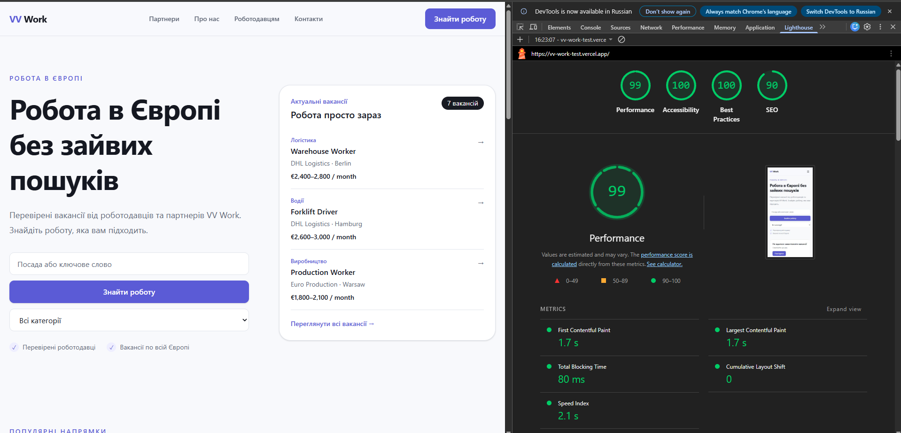

# VV Work

Тестове завдання — адаптивний вебзастосунок для пошуку вакансій у Європі та взаємодії кандидатів із роботодавцями.

## Demo

- Live: [Vercel deployment](https://vv-work-test.vercel.app/)
- Repository: [GitHub](https://github.com/veselhmelnik/vv-work-test)

## Tech stack

- React
- TypeScript
- Vite
- Tailwind CSS
- React Router
- Vitest
- React Testing Library
- jest-axe

Проєкт реалізований без сторонніх бібліотек

## Getting started

### Requirements

- Node.js 20+
- npm

### Installation

```bash
git clone https://github.com/veselhmelnik/vv-work-test.git
cd vv-work
npm install
```

### Development

```bash
npm run dev
```

### Production build

```bash
npm run build
npm run preview
```

### Tests

```bash
npm run test:run
```

### Coverage

```bash
npm run test:coverage
```

### Lint

```bash
npm run lint
```

## Architecture

```text
src/
├── app/                  # router та application-level configuration
├── components/           # shared layout та UI components
├── features/
│   ├── application/      # форма заявки, validation, modal
│   ├── partners/         # партнери та їх UI
│   └── vacancies/        # вакансії, filtering, cards, lists
├── hooks/                # reusable React hooks
├── lib/
│   └── api/              # mock API layer
├── mocks/                # mock data
├── pages/                # route-level pages
└── test/                 # test setup та accessibility tests
```

### Data layer

Дані проходять через окремий API layer:

```text
Component
   ↓
Hook
   ↓
lib/api
   ↓
mockFetch
   ↓
mock data
```

`mockFetch` імітує асинхронний API: затримку відповіді та помилки запиту.

### Async state

Для асинхронних запитів використовується `useAsync` hook.

Він підтримує:

- loading state;
- success state;
- error state;
- retry;
- захист від race conditions.

## Main functionality

### Candidates

- пошук вакансій за назвою;
- фільтрація за категорією;
- список вакансій;
- сторінки партнерів;
- подання заявки через modal;
- client-side validation;
- loading, empty та error states;
- URL-based filtering.

### Employers

- окремий CTA для роботодавців;
- контактна інформація;
- швидкий перехід до зв'язку з командою VV Work.

## Application form

Форма заявки містить:

- ім'я;
- телефон або Telegram;
- необов'язкове повідомлення.

Validation перевіряє обов'язкові поля, формат і довжину введених значень.

## Testing

Для тестів використані:

- Vitest;
- React Testing Library;
- user-event;
- jest-axe.

Покриті основні сценарії:

- `validateApplication`;
- `filterVacancies`;
- `useDebounce`;
- `useAsync`;
- retry logic;
- race-condition protection;
- URL filters;
- `ApplicationForm`;
- `ApplicationModal`;
- accessibility smoke test.

Поточний результат:

```text
Test Files: 8 passed
Tests:      33 passed
```

### Coverage

```text
Statements: 78.06%
Branches:   65.55%
Functions:  80.48%
Lines:      77.63%
```

Мінімальний coverage threshold у проєкті — 60%.

## Accessibility

У проєкті враховані базові accessibility-вимоги:

- semantic HTML;
- labels для form controls;
- `aria-invalid` та `aria-describedby`;
- `aria-live` для динамічних станів;
- keyboard navigation;
- Escape для modal;
- focus trapping;
- повернення focus після закриття modal;
- видимі focus states;
- коректний `lang="uk"` для сторінки;
- scroll margin для секцій зі sticky header.

Accessibility smoke test виконується через `jest-axe`.

## Lighthouse

Lighthouse запускався на production build.

Результат головної сторінки:

| Metric         | Score |
| -------------- | ----: |
| Performance    |    99 |
| Accessibility  |   100 |
| Best Practices |   100 |
| SEO            |    90 |

### Screenshot



## My decisions

1. **Окремий API layer**

   Компоненти не працюють безпосередньо з масивами mock data. Це дозволяє замінити mock API на реальний backend без переписування UI.

2. **URL як частина стану фільтрів**

   `search` та `category` зберігаються в query parameters. Завдяки цьому результат пошуку можна відкрити напряму, скопіювати посилання або відновити через browser history.

3. **Race-condition protection у `useAsync`**

   Старі запити не можуть перезаписати результат більш нового запиту або retry.

4. **Логіку винесено з page-компонентів**

   Filtering, async state, URL filters, validation та vacancy list винесені в окремі функції, hooks та components, щоб page-компоненти залишались відповідальними переважно за composition.

## Vacancy details flow

У поточній версії при натисканні на вакансію одразу відкривається modal із формою заявки.

Це свідоме спрощення для тестового завдання, щоб не розширювати scope окремою сторінкою деталей вакансії.

У production-версії flow був би іншим:

1. користувач натискає на vacancy card;
2. відкривається окрема сторінка вакансії, наприклад `/vacancies/:id`;
3. на сторінці показуються повні дані:
   - опис вакансії;
   - вимоги;
   - умови роботи;
   - зарплата;
   - локація;
   - роботодавець;
   - додаткова інформація;
4. користувач натискає кнопку `Подати заявку`;
5. після цього відкривається application modal або окрема application form.

Vacancy card відповідає за перехід до деталей вакансії, а не за безпосередню подачу заявки.

У поточній реалізації modal відкривається напряму з картки лише як UX-спрощення.

## Notes

Для реального production-рішення наступними кроками були б:

- підключення backend API;
- окрема сторінка детальної вакансії;
- server-side validation;
- persistent application storage;
- analytics та monitoring.
